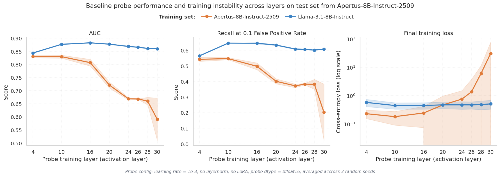
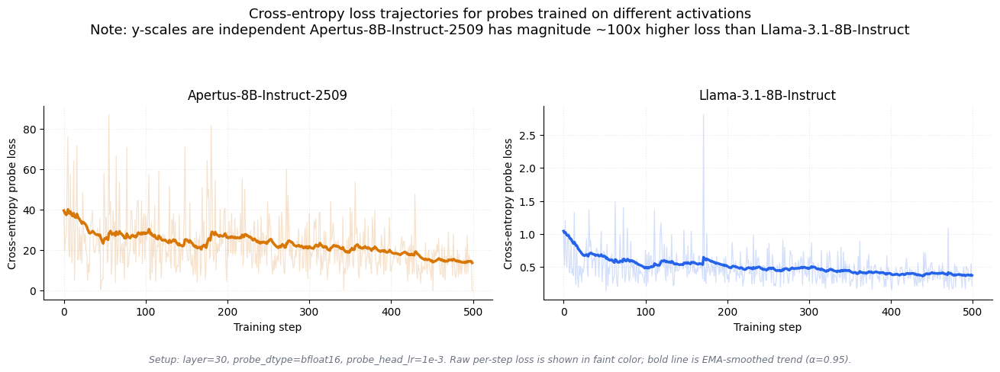
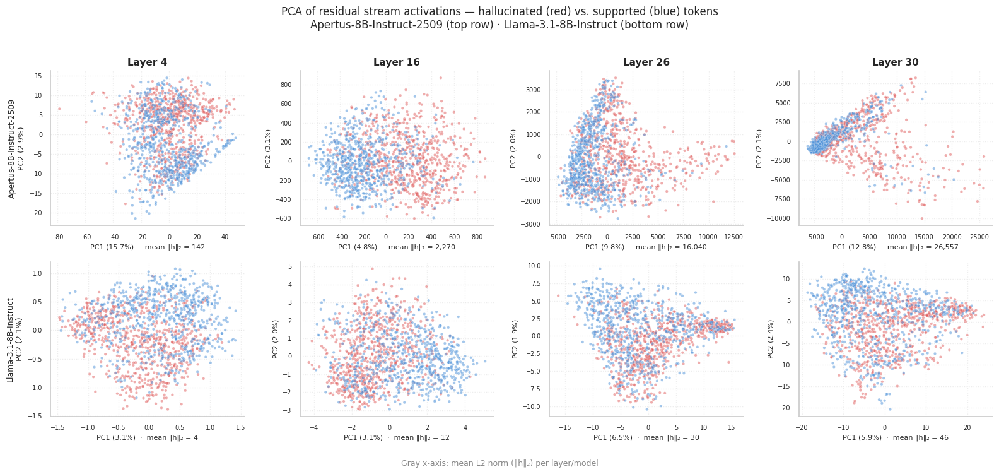
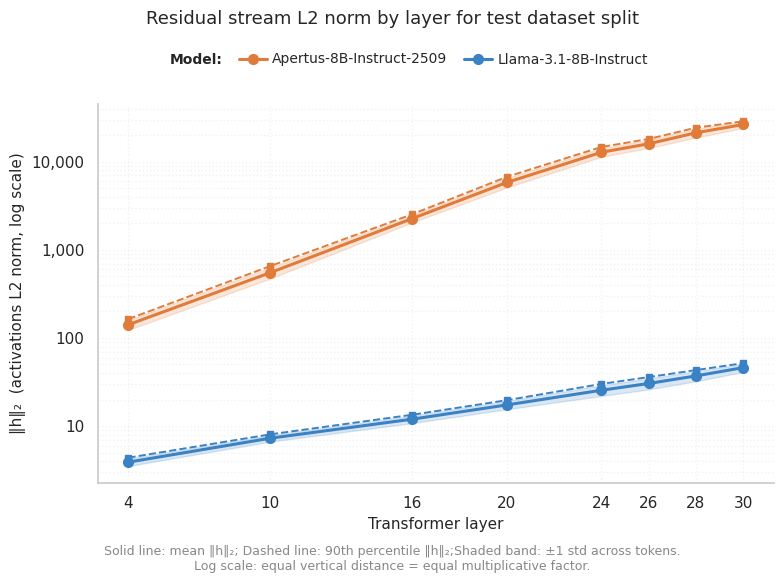
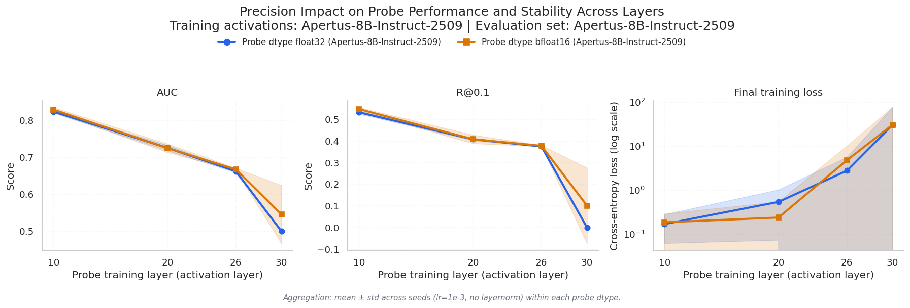
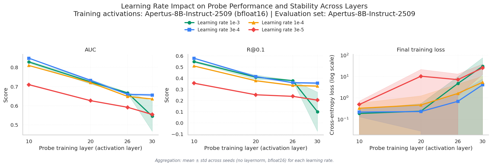
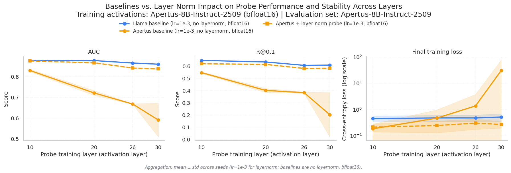
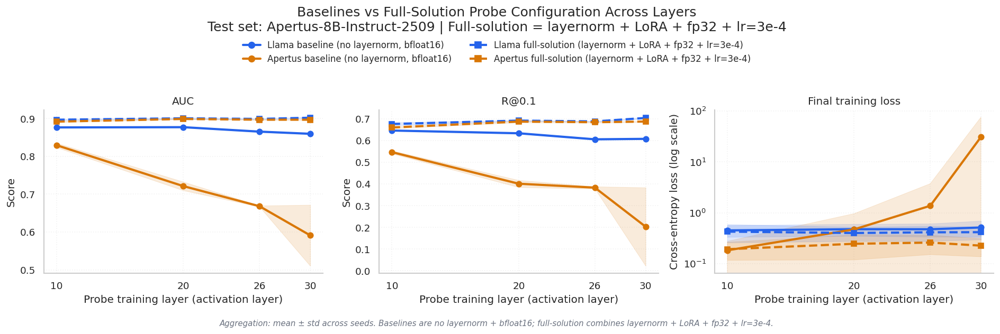

# Active Interpretability with Hallucination Probes: Exploding Activations in Apertus-8B-Instruct-2509

**Author:** Tymoteusz Kwieciński
**Date:** 2026-03-17

---

## TL;DR

This post covers the investigation process why hallucination probes trained on Apertus-8B-Instruct-2509 were significantly less stable than probes trained on Llama-3.1-Instruct. The main sympthom was a really strong degradation of probe quality in deeper layers and much noisier training loss. I formulated the hypothesis that the worse performance comes from exploding activations in deeper layers of Apertus-8B-Instruct-2509 model and proposed few fixes, improving the overall probe performance from 0.7025 to 	0.8961 AUC and 0.3837 to 0.6802 recall at 0.1 false positive ratio.

---

## Problem description 

### Background

As a part of Large Scale AI Enginering course we reproduced the paper [Real-Time Detection of Hallucinated Entities in Long-Form Generation
](https://arxiv.org/abs/2509.03531) for Apertus-8B-Instruct-2509 and tried to improve the probe performance.


Probes trained in the paper are used to detect hallucinated entities in the long-form text. This task is meant to reasemble the usual conversation with the model. A probe in this context is a small model trained on top of an LLM activations from a given layer, which performs a per-token classification task. In our setting, the probe was predicting whether a given token from the text is a hallucination or not. 


### The dataset description

An example from such dataset is presented below:

---

**User**: Tell me about Formula 1's current testing regulations, particularly focusing on restrictions during the season, pre-season testing allowances, rookie driver testing requirements, tire testing protocols, and any special testing permissions for development work.

**Model**: As of my knowledge cutoff in 2024, Formula 1's testing regulations have undergone significant changes over the years, with the primary goal of reducing costs and promoting more competitive racing. Here's an overview of the current testing regulations, focusing on the points you've mentioned:

### 1. Restrictions during the season
- **Seasonal Testing**: *Formula 1 teams are not allowed to conduct any official testing during the season*. This is to ensure that all teams have an equal opportunity to prepare for the championship and to prevent any team from gaining an unfair advantage through extensive testing.
- **Private Testing**: Teams are allowed to conduct private testing, but this is heavily restricted. Private testing is typically limited to a few days per year and is usually conducted on private tracks or simulators.

### 2. Pre-season testing allowances
- **Pre-season Testing**: Formula 1 teams are allowed to conduct pre-season testing, but this is also heavily restricted. The pre-season testing is usually conducted at the beginning of the year, typically at the same track where the first race of the season will be held.
- **Testing Days**: The number of testing days is limited. For example, in 2024, each team was allowed a maximum of *100 kilometers of testing per day*, with a total of *1500 kilometers allowed across all pre-season testing sessions*.


Below you can see the annoated spans - fragments of text that were confirmed to be false or true.
```

[
  {
    "index": 356,
    "label": "Supported",
    "span": "Formula 1 teams are not allowed to conduct any official testing during the season",
    "verification_note": "The FIA regulations restrict in-season testing to control costs and maintain fairness."
  },
  {
    "index": 875,
    "label": "Supported",
    "span": "Pre-season Testing",
    "verification_note": "Pre-season testing is allowed under FIA regulations with specified limits."
  },
  {
    "index": 1260,
    "label": "Not Supported",
    "span": "100 kilometers of testing per day",
    "verification_note": "No specific information found on a 100 kilometers per day limit; regulations normally specify total pre-season test days instead."
  },
  {
    "index": 1311,
    "label": "Not Supported",
    "span": "1500 kilometers allowed across all pre-season testing sessions",
    "verification_note": "No specific mileage limit per season found; FIA usually regulates the number of test days, not mileage."
  }
]
```

---


The dataset `[LongFact++](https://huggingface.co/datasets/obalcells/longfact-annotations)`, which was used in the paper to train hallucination probes was collected in 3 steps:
1. Question prompt collection
2. Model's answers generation


3. Generation annotation using larger LLM with websearch tool

The questions were generated to cover a wide area of general knowledge. The main source of questions was the `[LongFact](https://arxiv.org/abs/2403.18802)` dataset collected by Google, containing a corpus of similar questions. Authors of the reproduced paper generated 20k such questions accross different topics of knowledge. 

Then, they generated the models answers using a *generation pipeline*. They used various open-source models such as Llama-8B-Instruct, Llama-70B-Instruct, Mistral-Small-24B-Instruct-2501, etc.

Finally, the model's answers were annotated using another *pipeline*. In the original paper they used Anthropic Claude 4 Sonnet with websearch tool to factcheck the generations. 

To reproduce the probes for Apertus, we had to reproduce whole *generation* and *annotation* pipeline, finally obtaining the our version of the `LongFact++`, which is publicly available at [huggingface](https://huggingface.co/datasets/tkwiecinski/longfact-test-split). We generated the dataset for two models - Apertus-8B-Instruct-2509 and Llama-3.1-8B-Instruct. For more details regarding the reproduction, refer to the [project report](https://github.com/swiss-ai/feature-probes/blob/main/docs/reports/hallucination_detection.pdf). Unfortunately, it was imposible to match those datasets 1:1, because the documentation of both pipelines were lacking, but we still managed to create a usefull and well-prepared dataset.


### Probe training process

Each probe was trained on activations following a specified layer. We followed the authors of the reproduced paper and trained our probes on activations after 30th layer (both Apertus-8B-Instruct-2509 and Llama-8B-Instruct have 32 layers). Authors didn't compare probes trained on different layers and with different parameters, and so didn't we initally.

Probes were trained with a simple cross-entropy loss, commonly used in classification tasks. 

To improve the probe performance, authors also proposed using LoRA (Linear Adapters) - small linear layers reducing the dimensionality of the activations. For more details regarding this setup and training process refer to the [reproduced paper]((https://arxiv.org/abs/2509.03531)).


## The problem

While working on the project, we noticed that the probe trained on Apertus-8B-Instruct-2509, performs much worse on the training set generated with Apertus-8B-Instruct-2509 than the probe trained on Llama-8B-Instruct activations. I wanted to understand this behaviour a bit better and performed few evaluations. The most striking thing issue that I noticed, that the probe performance trained on Apertus-8B-Instruct-2509 degrades significantly in deeper layers of the model.





As you can see in the plot above, the Apertus-8B-Instruct-2509 probe performance drops significantly, after 16th layer. Final training loss also explodes around that layer. What is even more suprising, is that the probe trained on activations from Llama-8B-Instruct performs much better than the probe trained on the Apertus-8B-Instruct-2509 activations!


## Diagnosing the Instability

### Loss scale comparison
The cross-entropy loss for probe trained on Apertus activations is ~100x larger and much more spiky than for probe trained on Llama.



The plot above shows the scale. Even though the loss is much larger in scale, the training converges.

### Dataset validity

I also looked again into the dataset validity. Both datasets are valid, they contain similar number of hallucinated and supported spans, there are some minor differences in the completion lengths between Llama and Apertus models.

I compared our versions of the datasets with the ones from the paper and verified if there are no leaks between the training-test split. Additionally I manually verified few datapoints from each dataset version and tried to verify if there are no suprising artifacts, differences or any distribution shifts.


| Source | Model | Split | Rows | Spans/Row | Invalid Rate | Halluc. Rate | Completion Length (mean) | Completion Length (median) | Span Length (mean) | Span Length (90th percentile) |
|:-------|:--------------|:------|-------:|----------:|-------------:|-------------:|------------------:|-----------------:|----------------:|---------------:|
| ours | Apertus-8B | train | 17,986 | 9.59 | 0.025 | 0.236 | 3,014 | 2,778 | 25.66 | 52 |
| ours | Apertus-8B | test | 1,993 | 9.61 | 0.025 | 0.240 | 2,987 | 2,733 | 26.08 | 54 |
| ours | Llama-3.1-8B | train | 17,959 | 11.99 | 0.028 | 0.264 | 3,918 | 3,728 | 25.31 | 50 |
| ours | Llama-3.1-8B | test | 1,996 | 11.78 | 0.029 | 0.269 | 3,915 | 3,708 | 25.71 | 50 |
| paper | Llama-3.3-70B | train | 7,959 | 15.59 | 0.021 | 0.261 | 3,890 | 3,735 | 20.72 | 41 |
| paper | Llama-3.1-8B | train | 7,919 | 14.44 | 0.023 | 0.367 | 3,687 | 3,474 | 22.43 | 45 |
| paper | Mistral-24B | train | 1,534 | 14.20 | 0.034 | 0.170 | 3,567 | 3,560 | 19.87 | 39 |
| paper | Qwen2.5-7B | train | 1,524 | 12.64 | 0.045 | 0.350 | 3,782 | 3,757 | 21.60 | 43 |
| paper | Gemma-2-9B | train | 1,495 | 10.94 | 0.048 | 0.186 | 2,837 | 2,781 | 19.47 | 37 |

After all, the problem with instabliity and decreasing performance was not in the dataset.

### Activations clustering

It was possible to create a good classifier for the data (the probe trained on Llama activations). I also wanted to verify if there are no strage patterns in the activations itself. To do that I used PCA on activations from different layers




### Activations norm

Finally, I directly analysed the norm of per-layer mean norm of activations. As you can see in the plot below, activations in the Apertus model have much higher values than the values from Llama model. 



As can be seen below, the norm of Apertus activations is ~100 times larger than the norm of Llama activations, which matches the scale of loss difference

## Hypothesis

**Exploding activations** - activations in Apertus are very large, particularly in deeper layers.
This issue was brought up also by Julian Minder, I contacted him to ask for some details and he gave me some of the ideas how to fix the instability and improve the probe performance. 

As I found out, increasing activations in deeper layers of the transformer model are a natural model behavior (some [explanation](https://turntrout.com/residual-stream-norms-grow-exponentially-over-the-forward-pass)), but the explosion that could be present in Apertus-8B-Instruct-2509 was unnatural.


## Proposed solutions how to solve the problem

One of the most straightforward solution for solving the problem is to fix the exploding activations issue in the upcoming release of Apertus. I wanted to dig a bit deeper and verify if there is anything that proves that our hypothesis is the real source of the problem. 

Thus, I wanted to improve the probe performance and the stability accross runs with different seeds. I decided to try few solutions:

1. Use stronger precision (e.g. `fp32` instead of `bf16`)
2. Reduce learning rate for slower convergence
3. Use `layernorm` before feeding the activations in the probe
4. Use LoRA to stabilize the activations 


## Results

It turned out that the proposed solutions helped with stabilizing the runs and improving performance. Now, I will go over each of the solutions.

### Stronger precision

The intuition behind using a stronger precision to train the probe is that the float with more bits can express the large number with much better precision. I suspected, that changing the precision to `float32` we might be able to *tame* the exploding activations.




Using stronger precision - `float32` for training the probe, instead `brainfp16` used for model training improved the probe stability, but had no significant impact on the performance. 


### Smaller learning rate
Large learning rate can prevent the gradient descent-based algorithm from convergence. If the learning rate is too big for given setup, the final estimation can just scatter around the local minimum, not being able to reach a good result. Similar behaviour was observed in our case - the probe performance was different in each run and the training loss was not decreasing.


Reducing the learning rate only slightly, from 1e-3 to 3e-4 also helped to stabilize the runs and slightly improved the performance.





### Layernorms

As we assumed, the activations in the deeper layers of Apertus-8B-Instruct-2509 could have a very big magnitude. Another solution that can stabilize the runs and improve the performance is applying the layer norm before the probe. This technique normalizes the layer, to ensure that the probe input is optimally scaled. This can yield a similar effect to using better precision - operations performed near 0 (i.e. where activations after normalization lie) have much better precision for floating point numbers than the opertaions on floating points with a very large scale.




Using layernorm significatly improved the probe performance, making almost as good as the probe trained on Llama-3.1-8B-Instruct completions. This might suggest that activations of Llama-3.1-8B-Instruct have much smaller magnitude.


### LoRA 

As described in the reproduced paper, LoRA help improving the probe performance in general. Because adapters trained accross different transformer layers slightly modify the activations to make them more aligned with the task, the probe perfomance improves.




In the plot above, we can see that applying LoRA, selected learning rate, layernorm and better precision improved the probe performance and stabilized it.

### Total solution

The final performance metrics are summarized below:

| Probe model (train) | Evaluation set | Metric | Baseline mean | Full-solution mean | Absolute improvement |
|---|---|---|---:|---:|---:|
| Apertus-8B-Instruct-2509 | Apertus-8B-Instruct-2509 | AUC | 0.7025 | 0.8961 | +0.1935 |
| Apertus-8B-Instruct-2509 | Apertus-8B-Instruct-2509 | R@0.1 | 0.3837 | 0.6802 | +0.2966 |
 
### Stability summary 

| Stability indicator | Baseline | Full-solution | Change |
|---|---:|---:|---:|
| Mean final training loss | 8.236 | 0.232 | 97.2% lower |
| Seed-level loss std (avg over layers) | 11.887 | 0.099 | 72.2% lower |

To add additional context, baseline Llama-3.1-8B-Instruct  run has mean final loss equal to 0.480 - the solutions that I used to mitigate the problem of exploding activations managed to reduce the loss magnitude and reach even lower loss than baseline solution for Llama-3.1-8B-Instruct.

## Summary

In this short doc, I showcased how *active interpretability* approach can help in improving the performance of machine learning models. I went through a simple observation, to problem diagnostics, setting the hypothesis and finding the solution to the discovered problem. 


## Acknowledgements

I would like to thank Anna Hedström for supervision in the project.


